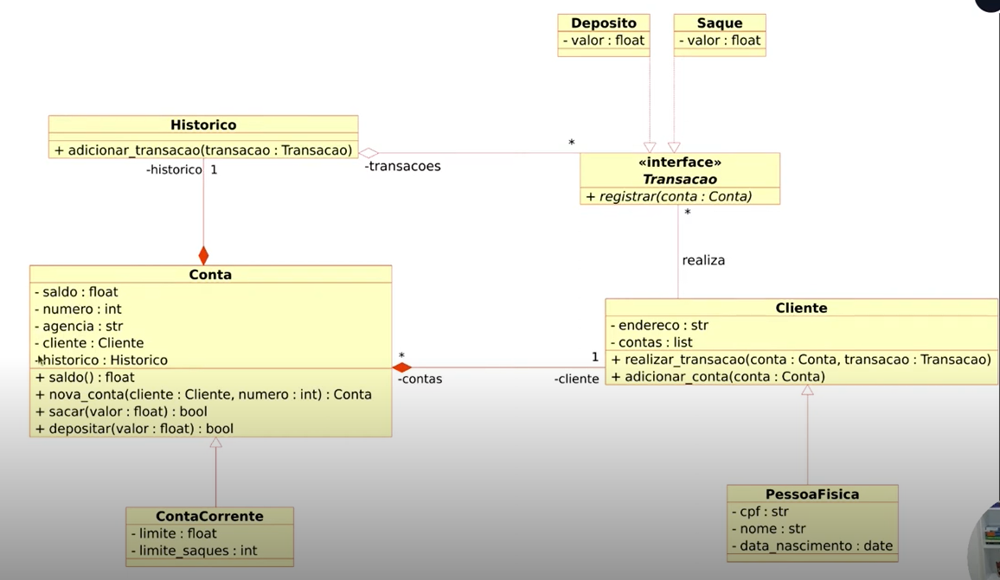

# 🏦 Banco Python – Sistema Bancário Orientado a Objetos

Projeto de um **sistema bancário em Python**, desenvolvido com foco em **Programação Orientada a Objetos (POO)**, boas práticas e organização de código.  
Permite o cadastro de clientes, criação de contas, depósitos, saques e visualização de extrato.

---

##  Diagrama

  

## 📌 Funcionalidades

- 👤 Cadastro de clientes (Pessoa Física)
- 🏦 Criação de conta corrente
- 💰 Depósito em conta
- 💸 Saque com regras de limite
- 📄 Extrato detalhado com histórico de transações
- 📋 Listagem de contas cadastradas

---

## 🧠 Regras de Negócio Implementadas

- Saque limitado a **R$ 500,00 por operação**
- Máximo de **3 saques diários**
- Não permite:
  - Saque sem saldo
  - Depósito ou saque com valor inválido
- Todas as transações são registradas com **data e hora**

---

## 🏗️ Arquitetura do Projeto

O sistema foi modelado utilizando conceitos sólidos de POO:

### Classes Principais
- `Cliente`
- `PessoaFisica`
- `Conta`
- `ContaCorrente`
- `Historico`
- `Transacao` (classe abstrata)
- `Saque`
- `Deposito`

### Conceitos Aplicados
- ✔️ Encapsulamento
- ✔️ Herança
- ✔️ Polimorfismo
- ✔️ Classes Abstratas (`ABC`)
- ✔️ Separação de responsabilidades

---

## 🛠️ Tecnologias Utilizadas

- **Python 3**
- Módulos padrão:
  - `abc`
  - `datetime`
  - `textwrap`

---

## 👨‍💻 Autor

- **Afonso Rafael**
Estudante de Back-End e apaixonado por tecnologia, focado em Python, Java e desenvolvimento de sistemas.
